# AI-SPY - AI Speech Detection Platform

[](https://ai-spy.xyz)
[](https://reactnative.dev/)
[](https://python.org)
[](https://fastapi.tiangolo.com/)
[](LICENSE)

> **The First AI Speech Detection Platform for Mobile Devices**  
> Launched in 2024, AI-SPY provides real-time AI speech detection with advanced transcription, sentiment analysis, and AI-powered insights to help users identify AI-generated content in audio.

## 🎯 Project Overview

AI-SPY is a comprehensive AI safety platform that helps users detect AI-generated speech in real-time. Built with a React Native mobile application and a production-ready Python API, the platform combines neural network analysis with advanced AI features to provide accurate detection and detailed insights.

### Key Achievements
- **First AI Speech Detection Mobile App**: Pioneering technology for mobile devices
- **Production-Ready Security**: Enterprise-grade authentication and security features
- **Advanced AI Integration**: Combines neural networks with LLM-powered analysis
- **Real-time Processing**: Sub-second analysis with word-level transcription

## 🏗️ Architecture


### Tech Stack
 
### Code-accurate architecture and request flow

#### Component/dataflow overview

```mermaid
flowchart LR
  A["Mobile App (Expo React Native)"]
  B["FastAPI API (app.py)"]
  C["AudioInference (PyTorch, audio_processor.py)"]
  D["Deepgram ASR (Transcription)"]
  E["Google Cloud Storage (GCS)"]
  F["Cloud Tasks (enqueue → HTTP POST /process-report)"]
  G["Gemini (Chat)"]
  H["In-memory jobs store (app.py: jobs dict)"]

  A -->|"POST /auth/token"| B
  A -->|"POST /generate-upload-url {file_name,type}"| B
  B -->|"V4 signed PUT URL (10s)"| A
  A -->|"PUT object bytes"| E
  A -->|"POST /report {bucket,file_name}"| B
  B -->|"create_task"| F
  F -->|"POST /process-report (authenticated by Cloud Tasks headers)"| B
  B -->|"download file"| E
  B -->|"analyze_file()"| C
  B -->|"transcribe_audio_file() (best‑effort)"| D
  B -->|"store formatted results"| H
  A -->|"GET /report-status/{task_id}?has_subscription=…"| B
  A -->|"POST /chat?has_subscription=…&task_id=…"| B
  B -->|"prompt with analysis context"| G
```



#### Background-job sequence

```mermaid
sequenceDiagram
  autonumber
  participant App as Mobile App
  participant API as FastAPI
  participant GCS as Google Cloud Storage
  participant Tasks as Cloud Tasks
  participant Proc as AudioInference (PyTorch)
  participant ASR as Deepgram ASR
  participant Store as jobs dict

  App->>API: POST /auth/token { app_user_id }
  API-->>App: { token, expires_in }
  App->>API: POST /generate-upload-url (Bearer token)
  API-->>App: { signed_url, file_name, bucket }
  App->>GCS: PUT object bytes (signed_url)
  App->>API: POST /report { bucket_name, file_name } (Bearer)
  API->>Tasks: create_task → /process-report
  Tasks-->>API: POST /process-report (task headers)
  API->>GCS: download file
  par Inference
    API->>Proc: analyze_file(temp_path)
    Proc-->>API: { per-chunk predictions/confidences, aggregates }
  and Transcription (best-effort)
    API->>ASR: transcribe_audio_file(temp_path)
    ASR-->>API: { text, words[timestamps], sentiment, summary }
  end
  API->>Store: jobs[task_id] = { status: completed, result[], overall_prediction, aggregate_confidence, transcription_data }
  App->>API: GET /report-status/{task_id}?has_subscription=… (Bearer)
  alt free tier
    API-->>App: { status, result: [summary + ALL timeline], transcription_data: null, is_limited: true }
  else pro
    API-->>App: Full job payload
  end
  App->>API: POST /chat?has_subscription=…&task_id=… { message, context, analysis_data? }
  API-->>App: { response, context }
```



#### Key endpoints (backend FastAPI)

- **Auth**: `POST /auth/token` → `{ token, expires_in }` (HMAC-signed custom bearer)
- **Signed upload**: `POST /generate-upload-url` → `{ signed_url, file_name, bucket }`
- **Start background analysis**: `POST /report { bucket_name, file_name }` → `{ task_id, status }`
- **Job status**: `GET /report-status/{task_id}?has_subscription=…` → completed payload (tier-aware)
- **Direct analyze (fallback)**: `POST /analyze` (`multipart/form-data` file) → immediate per-3s results
- **Transcription (direct)**: `POST /transcribe` (`multipart/form-data` file) → Deepgram result (free: 50 words)
- **Chat**: `POST /chat?has_subscription=…&task_id=…` with `{ message, context, analysis_data? }`

#### Inference and aggregation (PyTorch)

- Resample audio to 16 kHz, split into non-overlapping 3-second chunks
- Log-mel spectrogram (n_fft=512, hop=160, n_mels=128, f_min=20, f_max=8000, Slaney)
- `DeepfakeDetectorCNN` outputs AI probability per chunk; prediction = AI if > 0.5 else Human; confidence = max(p, 1-p)
- Aggregation:
  - `aggregate_confidence` = mean(chunk confidences)
  - Overall label: AI if percent_ai > 60; Human if percent_human > 60; Uncertain if 40–60 aggregate; otherwise Mixed

#### Tier behavior

- Free: full timeline + summary; transcription omitted; chat disabled
- Pro: full payload (timeline + transcription) and chat (10 messages per report)

**Mobile Application (React Native)**
- **Frontend**: React Native 0.72+ with Expo
- **UI Framework**: Custom Glass Morphism Components
- **State Management**: React Hooks + Context API
- **Authentication**: JWT with SecureStore
- **Styling**: Tailwind CSS (NativeWind)

**Backend API (Python)**
- **Framework**: FastAPI with Uvicorn
- **AI Models**: PyTorch neural networks + OpenAI/Gemini
- **Transcription**: Deepgram API
- **Security**: JWT authentication with refresh tokens
- **Deployment**: Docker containers on Google Cloud Run

**Infrastructure**
- **Cloud Platform**: Google Cloud Platform
- **Container Orchestration**: Docker
- **Database**: Vector storage for embeddings
- **Monitoring**: Health checks and security logging

## 🔒 Security & Sensitive Information

### What's Omitted for Security
This repository has been sanitized for public release. The following sensitive information has been removed or replaced with placeholders:

**API Keys & Secrets:**
- Deepgram API keys
- Google AI API keys  
- OpenAI API keys
- JWT secrets
- RevenueCat API keys

**Infrastructure Details:**
- Google Cloud project IDs
- Cloud Storage bucket names
- Cloud Tasks queue names
- Production API URLs and domains
- Service account credentials

**Configuration Files:**
- Production environment variables
- API endpoint URLs
- Database connection strings
- Third-party service credentials

### Required Configuration
To run this project, you'll need to:
1. Obtain your own API keys from Deepgram, Google AI, and OpenAI
2. Set up your own Google Cloud project and resources
3. Configure environment variables using the provided templates
4. Replace placeholder URLs with your actual API endpoints

### Security Best Practices
- **Never commit API keys or secrets** to version control
- **Use environment variables** for all sensitive configuration
- **Rotate API keys regularly** and monitor usage
- **Use HTTPS** for all production API endpoints
- **Implement proper authentication** and authorization
- **Monitor logs** for suspicious activity
- **Keep dependencies updated** to patch security vulnerabilities

## 📱 What's in This Repository?

### Mobile Application (`ai-spy-mobile-app/`)
This repository contains the complete React Native mobile application codebase for AI-SPY. It includes:

- **Complete UI Components**: Glass morphism design system with animated interactions
- **Authentication System**: JWT token management with secure storage
- **API Integration**: Comprehensive networking layer with error handling
- **Subscription Management**: Tier-based feature access (Free/Pro)
- **Real-time Processing**: Background job management and progress tracking
- **Advanced Features**: AI chat assistant, sentiment analysis, content summarization

**Key Implementation Highlights:**
- `Components/GlassComponents.js`: Custom glass morphism UI system
- `Components/enhancedApiService.js`: Production-ready API service with authentication
- `Screens/Home.js`: Main file upload and processing interface
- `Components/Results.js`: Comprehensive results display with interactive charts
- `Components/ChatScreen.js`: AI-powered chat assistant with markdown support

### Backend API (`api-mobile-app/`)
This repository contains the production-ready Python API backend with enterprise security features:

- **Neural Network Models**: PyTorch-based AI speech detection models
- **Authentication System**: JWT with refresh tokens and revocation
- **Advanced Transcription**: Deepgram integration with sentiment analysis
- **AI Chat Service**: Gemini-powered contextual assistance
- **Security Features**: Rate limiting, CORS protection, file validation
- **Production Deployment**: Docker containers with health monitoring

**Key Implementation Highlights:**
- `app.py`: Main FastAPI application with comprehensive security
- `audio_processor.py`: Neural network inference and audio processing
- `chat_service.py`: AI chat assistant with context management
- `security_config.py`: Production security configurations
- `model.py`: PyTorch model architecture and inference

## 🚀 Getting Started

### Prerequisites
- Node.js 16+ and npm
- Python 3.9+
- Expo CLI
- iOS Simulator or Android Emulator

### Mobile Application Setup

```bash
# Navigate to mobile app directory
cd ai-spy-mobile-app

# Install dependencies
npm install --legacy-peer-deps

# Copy configuration template
cp config.example.js config.js

# Edit config.js and set your API_BASE_URL
# Replace 'https://your-api-domain.com' with your actual API domain

# Start development server
npm start

# Run on iOS
npm run ios

# Run on Android
npm run android
```

### Backend API Setup

```bash
# Navigate to API directory
cd api-mobile-app

# Install Python dependencies
pip install -r requirements.txt

# Copy environment configuration template
cp env.yaml .env

# Configure environment variables in .env file:
# - DEEPGRAM_API_KEY: Your Deepgram API key
# - GOOGLE_AI_API_KEY: Your Google AI API key
# - JWT_SECRET: A secure 32+ character secret
# - API_BASE_URL: Your API domain
# - GOOGLE_CLOUD_PROJECT: Your GCP project ID (optional)

# Run development server
python app.py
```

### Production Deployment

```bash
# Build and deploy API
docker build -t ai-spy-api .
docker run -p 8000:8000 --env-file .env ai-spy-api

# Deploy mobile app
eas build --platform ios
eas build --platform android
```

## 🔐 Security Features

### Authentication & Authorization
- **JWT-based authentication** with refresh tokens
- **Token revocation** capability
- **Rate limiting** on all endpoints
- **Secure token storage** using Expo SecureStore

### API Security
- **Comprehensive security headers** (HSTS, CSP, X-Frame-Options)
- **CORS protection** with configurable origins
- **File validation** with MIME type and content checking
- **Request size limits** (25MB max file size)
- **Suspicious request detection** and blocking

### Infrastructure Security
- **Non-root container execution**
- **Security-focused Dockerfile**
- **Environment-based configuration**
- **Comprehensive logging** with security event tracking

## 📊 Data Flow & Processing

### Enhanced Processing Pipeline
1. **File Upload** → Secure file validation and processing
2. **Authentication** → JWT token generation and validation
3. **Neural Analysis** → AI speech detection with confidence scoring
4. **Transcription** → Word-level transcription with timestamps
5. **AI Enhancement** → Sentiment analysis and content summarization
6. **Results Delivery** → Comprehensive analysis with interactive visualization

### Data Structure
```javascript
// Enhanced Result Format
{
  aggregate_confidence: 0.85,
  overall_prediction: "AI",
  file_name: "audio.mp3",
  result: [
    {
      timestamp: 0,
      prediction: "ai",
      confidence: 0.9,
      summary_statistics: {
        speech_clips: {
          ai_clips: { percentage: 70 },
          human_clips: { percentage: 30 }
        }
      }
    }
  ],
  transcription_data: {
    text: "Full transcription...",
    words: [
      { word: "Hello", start: 0.0, end: 0.5, ai_confidence: 0.8 }
    ],
    average_sentiment: {
      sentiment: "positive",
      sentiment_score: 0.7
    },
    summary: "Content summary..."
  }
}
```

## 💰 Subscription Tiers

### Free Tier
- Limited transcription (50 words)
- Limited analysis results (3 chunks)
- No AI chat access
- Truncated summaries

### Pro Tier
- Full transcription access
- Unlimited analysis results
- AI chat assistant (10 messages per report)
- Complete content summaries
- Advanced analytics and insights

## 🎨 UI/UX Features

### Glass Morphism Design
- **Modern translucent UI** components with blur effects
- **Animated interactions** with smooth transitions
- **Responsive layout** optimized for all screen sizes
- **Dark theme** with professional aesthetics

### Interactive Components
- **Timeline Visualization**: Interactive timeline with detailed analysis points
- **Color-coded Transcription**: Word-level AI detection highlighting
- **Pie Charts**: Visual representation of AI vs human speech percentages
- **Progress Indicators**: Real-time processing status with animations

## 🔧 Development & Contributing

### Code Style
- **React Native**: Functional components with hooks
- **Python**: PEP 8 compliance with type hints
- **Documentation**: Comprehensive docstrings and comments
- **Testing**: Unit tests for critical components

### Development Workflow
1. Feature development in feature branches
2. Code review and testing on both platforms
3. Security validation for all API changes
4. Documentation updates for new features
5. Production deployment with health monitoring

## 📈 Performance Optimizations

### Mobile Application
- **Foreground Processing**: Jobs require app to remain active
- **Caching**: Subscription status and user data caching
- **Optimized Rendering**: Efficient component updates
- **Memory Management**: Proper cleanup and disposal

### Backend API
- **Async Processing**: Non-blocking request handling
- **Model Optimization**: Efficient neural network inference
- **Connection Pooling**: Optimized database connections
- **Caching**: Response caching for repeated requests

## 🚀 Future Roadmap

### Planned Features
- **Offline Mode**: Local processing capabilities
- **Batch Processing**: Multiple file analysis
- **Export Features**: PDF reports and data export
- **Advanced Analytics**: Usage statistics and insights
- **Social Features**: Sharing and collaboration
- **Real-time Streaming**: Live audio analysis

### Technical Enhancements
- **Edge Computing**: On-device processing capabilities
- **Advanced Models**: Improved neural network architectures
- **Multi-language Support**: International language detection
- **API Versioning**: Backward-compatible API evolution

## 📄 License

This project is proprietary software for the AI-SPY platform. All rights reserved.

## 🌐 Links

- **Website**: [ai-spy.xyz](https://ai-spy.xyz)
- **Mobile App**: Available on iOS and Android
- **API Documentation**: Integrated Swagger UI at `/docs`
- **Security Status**: Optional diagnostics endpoint at `/security-status` (requires `ENABLE_SECURITY_STATUS=true`)

## 🤝 Support

For technical support, security issues, or business inquiries:
- **Email**: [contact@ai-spy.xyz](mailto:contact@ai-spy.xyz)
- **Documentation**: [docs.ai-spy.xyz](https://docs.ai-spy.xyz)
- **Status Page**: [status.ai-spy.xyz](https://status.ai-spy.xyz)

---

**AI-SPY** - Pioneering AI safety through advanced speech detection technology. 